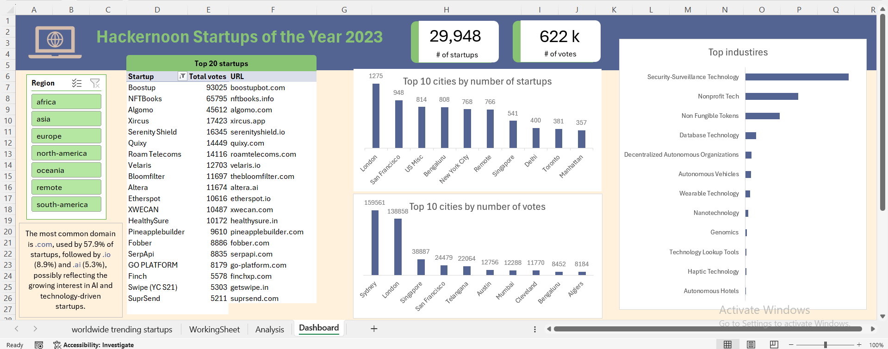

# Startup Analysis & Insights Dashboard

## Project Overview
Open source data for HackerNoon's Startup of The Year Votes: over 623,000 total votes were cast for nearly 30,000 startups from 2,000+ cities worldwide.
The goal was to uncover global startup trending providing a deeper understanding of startup distribution, industry performance, and domain preferences.

## Key Findings
- **Startup Growth**: Startups are primarily concentrated in major cities, with the highest activity observed in London, San Francisco, Bengaluru and New York.  
- **Industry Trends**: Tech and AI-related startups show the highest growth, specifically in Security-Surveillance Technology and Non-profit Tech.
- **Dominant Domains**: The most commonly used domain is .com (57.9%), followed by .io (8.9%) and .ai (5.3%), which reflects the growing prominence of tech and AI startups.

## Dashboard Screenshot

## How to Access/Run the Dashboard
You can view the dashboard by reviewing the Excel file attached in the repository.
