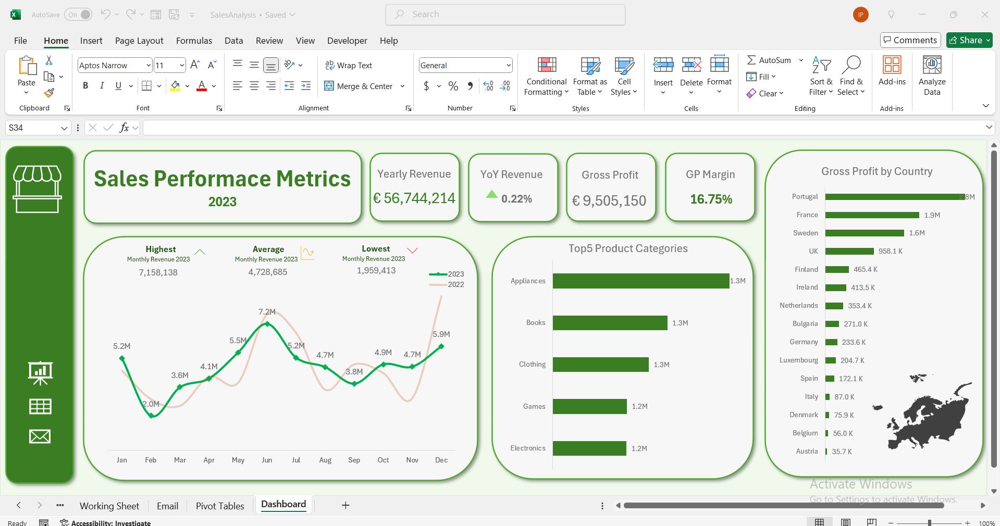

# E-commerce Sales Analysis & Dashboard

## Project Overview
This project involves analyzing sales data from an e-commerce platform and building an dashboard to visualize key metrics and trends. The goal was to derive actionable insights into sales performance, customer behavior, and product popularity, helping the business gain a comprehensive overview of year-over-year performance.

## Analysis Process
1. **Data Cleaning**: The initial dataset was raw and required cleaning, including checking for missing values, adding calculated columns and ensuring proper data formatting.
2. **Exploratory Data Analysis (EDA)**: Performed an initial exploration to understand key metrics such as total sales, average order value and product category performance.
3. **Trend Analysis**: Analyzed seasonal trends, identified peak sales periods, and the popularity of product categories over time.

## Key Findings
- **Profitability**: The observed Gross Profit (GP) Margin for the year was 16.75%, reflecting strong profitability across product categories.
- **Top Performing Products**: The top-selling products in 2023 were in the categories of Appliances, Books, Clothing, Games, and Electronics.
- **Seasonal Trends**: Sales spiked in June and December, following similar trends observed in the previous year.
- **Market Performance**: Data showes that Portugal and France were the largest contributors to profit, accounting for nearly half of the overall revenue.
  
## Dachboard Screenshot

## How to Access/Run the Dashboard
You can view the dashboard by reviewing the Excel file attached in the repository.
